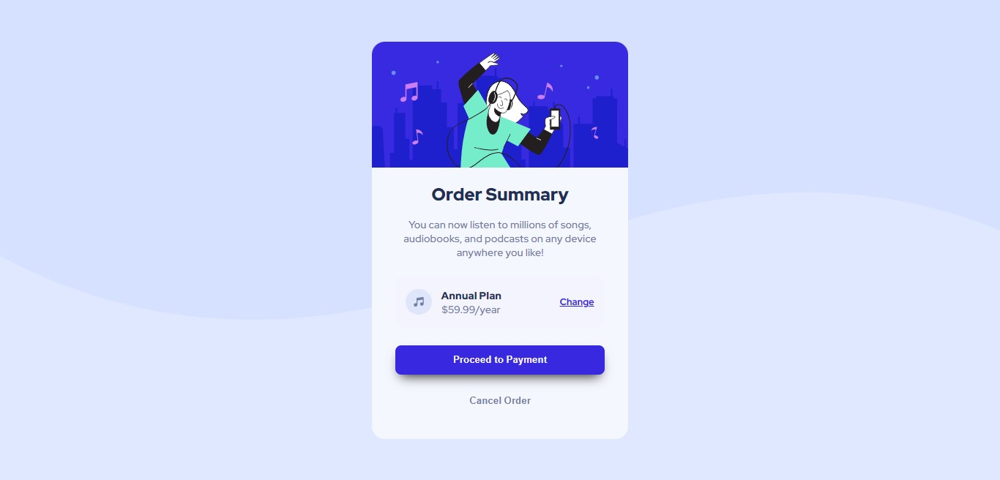

# Frontend Mentor - Order Summary Card

Esta é uma solução para o desafio [Order summary card](https://www.frontendmentor.io/challenges/order-summary-component-QlPmajDUj). 

Os desafios do Frontend Mentor ajudam a melhorar as habilidades de desenvolvimento ao construir projetos reais.

## Índice
- [O desafio](#o-desafio)
  - [Screenshot](#screenshot)
  - [Links](#links)
- [Meu processo](#meu-processo)
  - [Ferramentas](#ferramentas)
  - [O que eu aprendi](#o-que-eu-aprendi)

## O Desafio 

- Elabore o projeto de acordo com os designs fornecidos.

### Screenshot 

### Links 

- [Solução] ()

## Meu processo

### Ferramentas

- HTML5
- SASS

### O que eu aprendi

Com estes projetos tento reforçar os conceitos de HTML5, responsividade e estilização de páginas com o pré-processador [SASS](https://sass-lang.com/). 
Percebo que preciso melhorar um pouco mais as noções de alturas e larguras fixas e responsivas, visto que precisamos de um design que se adapte aos diversos tipos de dispostivos. 

